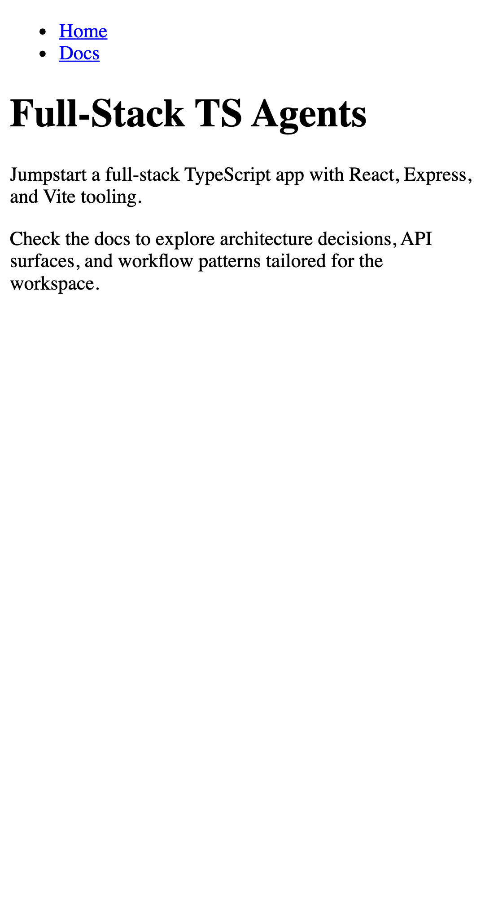
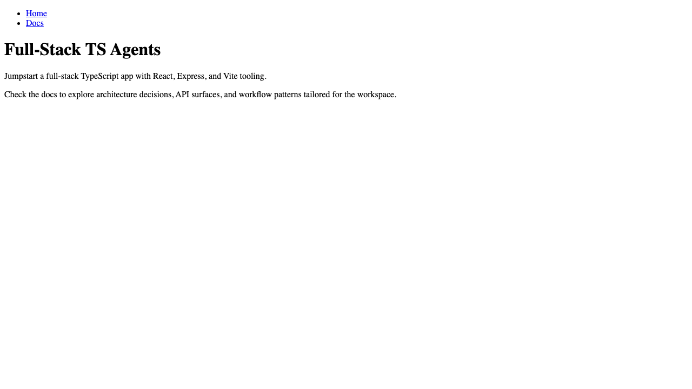
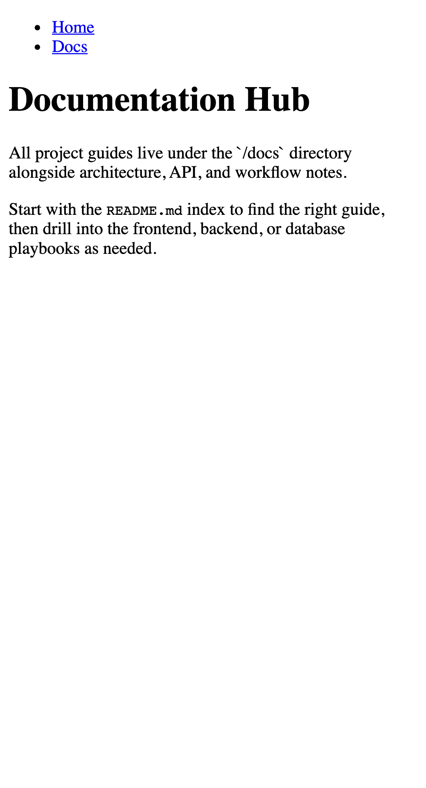
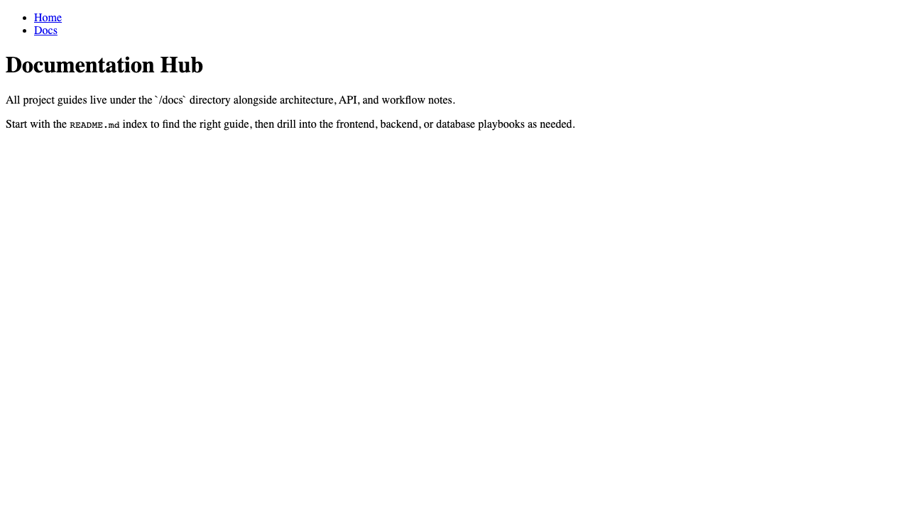

# Crawl Report

Generated at: 2025-09-27T20:13:27.261Z

Base URL: http://localhost:5173

Routes scanned: `/`, `/docs`

## Regenerate This Report
1. Start the client (and any required backend services).
2. Run `npm run crawl:playwright -- --base http://localhost:5173 --routes /,/docs` from the repo root.

## Full-Stack TS Agents

- Route: `/`
- URL: http://localhost:5173/
- Title: Full-Stack TS Agents
- Primary heading: Full-Stack TS Agents
- Meta description: —
- Links on page: 2
- Approximate word count: 32

> Jumpstart a full-stack TypeScript app with React, Express, and Vite tooling.

<figure>
  
  <figcaption>Mobile (Pixel 5)</figcaption>
</figure>

<figure>
  
  <figcaption>Tablet (iPad (gen 7) portrait)</figcaption>
</figure>

<figure>
  
  <figcaption>Desktop (Chrome)</figcaption>
</figure>

---

## Documentation Hub

- Route: `/docs`
- URL: http://localhost:5173/docs
- Title: Full-Stack TS Agents
- Primary heading: Documentation Hub
- Meta description: —
- Links on page: 2
- Approximate word count: 39

> All project guides live under the `/docs` directory alongside architecture, API, and workflow notes.

<figure>
  
  <figcaption>Mobile (Pixel 5)</figcaption>
</figure>

<figure>
  
  <figcaption>Tablet (iPad (gen 7) portrait)</figcaption>
</figure>

<figure>
  
  <figcaption>Desktop (Chrome)</figcaption>
</figure>
